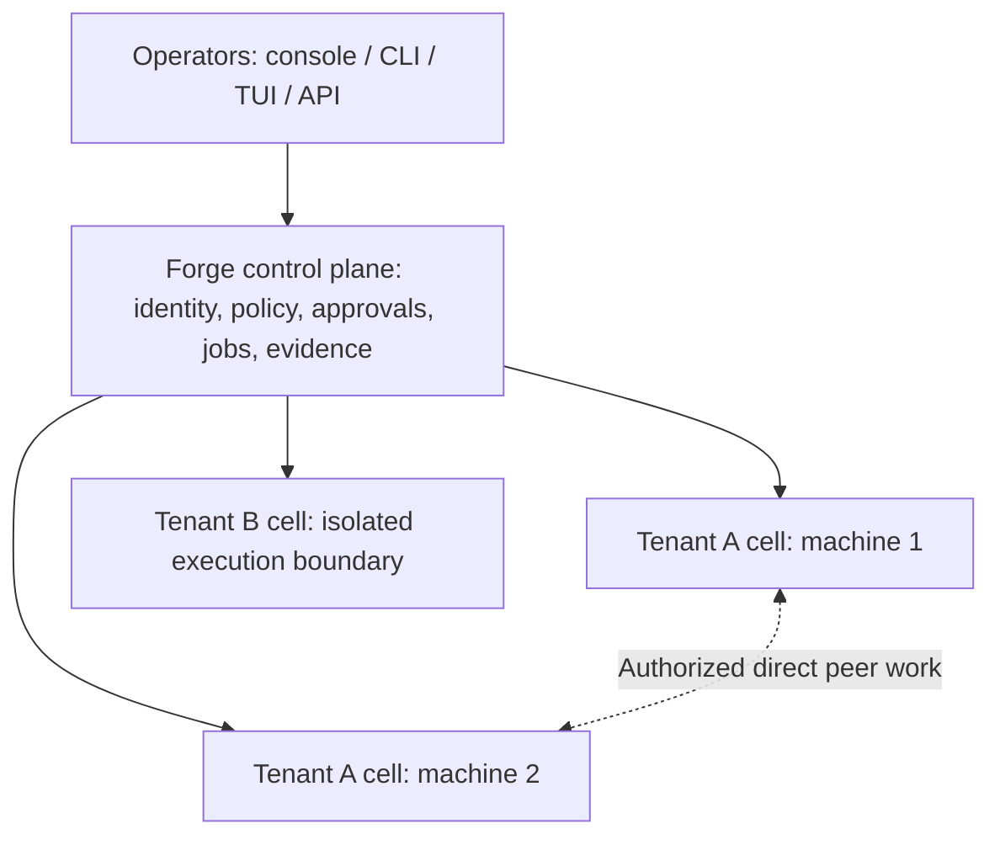

# 2.0.0 roadmap: multi-machine, multi-tenant operator control

Status: planned release scope; implementation and promotion gates are open.
Direction recorded: 2026-09-04.

## Release boundary

The current release work is to **repair and complete 1.2.0**, not to replace it
with a 1.2.1 release. This roadmap targets **2.0.0**. It does not bump package
versions, modify release artifacts or tags, or fold fleet features into the
1.2.0 repair. Published tag and artifact immutability remain governed by the
[contribution and release policy](../CONTRIBUTING.md).

The 2.0.0 target supersedes the earlier 1.3.0 planning target. The major version
reflects a product and authority-model transition: from a local assistant with
advanced operator features to an operator control platform spanning machines
and tenants. It permits deliberate, documented compatibility transitions, not
gratuitous breakage or an automatic production-readiness claim.

Planning, contract design, and any separately authorized isolated development
can proceed on separate tracks.
The accepted 1.2.0 repair and its exact-artifact evidence must establish the
upgrade baseline before 2.0.0 release qualification. Record the actual baseline
commit, artifact digests, and schemas at that gate; do not infer them from an
older checkout or a historical roadmap.

This document supersedes the [post-1.1 roadmap](post-1.1-roadmap.md) for forward
feature sequencing. The [v1 compatibility policy](v1-compatibility.md) continues
to govern the 1.x line; a separate 2.0 compatibility contract is a release
deliverable. This roadmap does not promote an experimental feature by
declaration or assert that the work below already exists.

## Product objective

Evolve Odinn Forge into a **self-hosted operator control plane that authorizes,
coordinates, and verifies AI-assisted work across machines and isolated tenant
environments**.

The first audience is operators and small teams managing their own fleet,
with a path toward managed client environments. The first proving ground is
an internal lab with synthetic tenants, not production client data. This is a
product hypothesis to validate through the pilot, not a claim of market demand.

The assistant, console, CLI, TUI, and API are interfaces to the same governed
operations. The operator should be able to answer:

> For this tenant, on these machines, what work is authorized, what actually
> happened, what evidence supports the result, and what needs intervention?

The local single-user experience remains the smallest supported deployment.
An ordinary local installation must not require a fleet controller, identity
provider, container cluster, or new network listener.

## 2.0.0 release outcome

Deliver one complete, opt-in **operator fleet preview**, while preserving the
local workflow and a documented transition from the stable 1.x contract:

- authenticated tenant and operator scope across inventory, jobs, approvals,
  runtimes, artifacts, recovery, and audit;
- explicit enrollment and inventory of multiple machines;
- native Forge execution in tenant-isolated runtime cells on remote machines;
- durable, policy-bound dispatch, cancellation, result reconciliation, and
  verification;
- shared operator views with attributable approvals and bounded tenant quotas;
- tenant lifecycle, backup/restore, revocation, and privacy-aware evidence;
- a bounded OpenClaw/A2A interoperability adapter and direct same-tenant peer
  proof, with its actual enforcement tier stated honestly.

The preview label does not waive isolation, authorization, migration, or
failure-path gates. Separate clients must not be placed in a shared execution
boundary merely because the interface is experimental. Production client-hosting
claims require a separately approved support profile and its evidence.

## 1.x to 2.0 compatibility and upgrade plan

R200-01 must inventory CLI commands, HTTP/protocol contracts, configuration,
state schemas, plugins, provider integrations, and supported installation
paths. Mark each as preserved, additively extended, deprecated with a transition,
or deliberately changed. Publish the resulting 2.0 support and compatibility
contract before the release candidate; a new major number is not a substitute
for that inventory.

- Use repaired **1.2.0** as the direct upgrade baseline; do not require an
  intermediate 1.2.1 or 1.3.0 installation.
- Preserve the local single-user workflow. Map existing local state to an
  explicit local owner/tenant context without enabling hosting, enrolling nodes,
  sharing memory, or expanding credentials and permissions automatically.
- Introduce versioned remote execution and receipt contracts. Reject unsupported
  peers with an actionable compatibility result; do not negotiate a weaker
  authority boundary to keep a connection alive.
- Document every breaking interface/configuration change, its rationale,
  migration tooling, and alternatives. Preserve unchanged interfaces where
  practical and identify any time-bounded compatibility adapters.
- Before changing persistent state, create and verify the protected backup.
  Exercise interrupted migration and restoration with the actual 1.2.0 and
  2.0 candidate binaries. An older binary must refuse incompatible new state;
  downgrade uses the documented backup/restore path, not an assumed in-place
  reverse migration.
- Keep opting into fleet mode separate from upgrading the application. Let
  users review the tenant, node, credential, and isolation changes before
  enabling them. A 2.0 local install must remain useful without fleet services.

The lab preview, prerelease qualification, and final 2.0.0 promotion are distinct
gates. Record the delivered fleet support profile at release cut; the major
version does not turn unqualified platforms or client-hosting scenarios into
supported deployments.

## Current foundation and remaining gaps

The baseline inventory below was inspected against source commit
`4f0f27bd3cc77fb926810865185e2bfdf66161cf`. This planning checkout is not the
qualified release baseline. Revalidate the inventory at implementation kickoff
and bind upgrade qualification to the repaired 1.2.0 artifact under R200-00.

| Reusable foundation | Remaining 2.0.0 work |
| --- | --- |
| [Unified operator contract](operator-control-plane.md) across console, API, CLI, and TUI | Tenant- and fleet-scoped projections and actions without a second authority path. |
| [Hosted users, tenants, memberships, roles, and separate state](security/multi-user-host.md) | End-to-end scope closure, same-tenant collaboration, and enforceable execution isolation. Current separation is application-level. |
| [Execution admission](architecture/execution-admission.md), capability decisions, and approvals | A versioned remote contract binding tenant, target cell/node, authenticated initiator, delegated authority, and execution generation. |
| Durable jobs, workflows, leases, and recovery states | Remote dispatch and reconciliation. The current executor resolves local workspaces and forks local workers. |
| [Gateway ownership fencing](gateway-instance-ownership.md) | Distributed dispatch fencing and explicit controller-loss behavior. A local state-root lease is not cross-host consensus. |
| [Authenticated remote-node reads](remote-node-read.md) | Enrollment and governed remote jobs. Existing node tools expose only status and bounded diagnostics. |
| Runemark, Gatewatch, Norn Restore, Raven Route, and local audit | Remote assertion evidence, tenant-scoped model routes, bounded recovery, and correlated receipts. Local integrity journals are not independent remote attestation. |
| Persistent runtime-agent identity and model-provider adapters | A separate runtime-adapter contract. A provider API or CLI model transport is not an adapter for an arbitrary external assistant harness. |

Use the injected job executor and workflow dispatch boundaries to introduce
remote execution. Keep execution admission, policy, and settlement canonical;
do not build a parallel remote shell path that bypasses them.

## Architecture and ownership

### Identity model

- **User:** authenticated human identity; may hold memberships in several tenants.
- **Tenant:** ownership, authority, resource-budget, and data-lifecycle boundary.
- **Node:** enrolled machine identity and advertised capabilities; not a tenant.
- **Runtime cell:** one tenant's execution identity, workspace, state, credentials,
  and enforcement boundary on a node. One tenant may span nodes; one physical
  machine may host multiple cells only through an approved isolation profile.
- **Agent/runtime:** an installed, versioned execution capability associated with
  a cell. Agent identity and model/provider choice remain separate concepts.
- **Run:** immutable admitted intent plus mutable attempts, physical outcomes,
  verification, and recovery records.

Node enrollment never grants access to every tenant. Tenant selection never
comes from model text or an unchecked request header. Scope is derived from
authenticated membership and carried through every owning store and API.

### Control plane

Own identity and membership, inventory, placement, policy distribution,
approval state, durable job intent, quotas, and tenant-scoped evidence views.
Use the existing operator contract rather than separate UI-only semantics.
The initial controller is single-active with tested backup and recovery;
active-active controllers and fleet-wide consensus are not 2.0.0 requirements.

### Execution cells

Cells own local admission, execution, secrets, workspace containment, bounded
result storage, cancellation, and recovery. Prefer authenticated outbound
connections from explicitly enrolled nodes; pin controller/node identity,
support revocation and protocol-version rejection, and do not require public
inbound administration ports on every machine.

Credentials resolve within the authorized cell through protected references.
The control plane must not become a shared plaintext credential pool. Existing
hosted-mode restrictions on private inference, CLI providers, remote nodes,
host environment inheritance, and device access remain intact. New functionality
uses a separately isolated, tenant-owned execution path.

### Direct peers and controller availability

Central visibility must not require relaying every agent conversation through
the controller. Explicitly authorized peers within a tenant can communicate
directly. The receiver validates tenant, sender, destination, permitted work,
expiry, and replay identity before executing anything. No automatic broadcast,
discovery-as-authorization, cross-tenant delegation, or transitive authority.
The initial delegated peer path is one hop; forwarding needs new admission.

An unavailable node must not stall unrelated nodes. During controller loss,
cells may finish only already admitted work within its existing scope and
bounded lease. New work requiring approval or fresh authority fails closed.
Offline behavior, lease expiry, revocation delay, and later reconciliation
must be explicit and tested; offline connectivity never creates authority.

### Runtime adapter enforcement tiers

| Tier | Promise |
| --- | --- |
| Observe | Read authorized inventory, status, and evidence; no execution authority. |
| Propose | Prepare a bounded request or handoff; execution remains outside Forge's enforcement promise. |
| Governed | Every admitted action crosses enforceable local policy, approval, tenant, and receipt boundaries; unsupported capabilities fail closed. |

An external runtime is not governed merely because Forge launched it or logged
its answer. Each adapter publishes supported operations, platform/isolation
requirements, protocol versions, cancellation and recovery semantics, and its
tested tier. Do not silently fall back to unconfined execution.

## Delivery sequence

All milestones below start **planned**. Leads are ownership roles, not evidence
of assignment or completion. Implement through bounded reviewed PRs; migrations
and remote execution require their own explicit evidence. Dependencies are
gates, not calendar estimates.

| ID | Milestone and dependency | Deliverables | Exit evidence | Lead / cross-review |
| --- | --- | --- | --- | --- |
| R200-00 | Baseline; independent of roadmap drafting | Complete 1.2.0 repair and identify the exact direct-upgrade artifact and schemas. | Accepted release-repair evidence and immutable baseline recorded; no 1.2.1 or 1.3.0 dependency. | Release / QA |
| R200-01 | Authority and protocol design; before implementation fan-out | Tenant/node/cell/principal identities, delegation model, versioned job/receipt schemas, supported operations, threat model, reuse decisions, support-profile matrix, and the 1.x-to-2.0 compatibility inventory. | Architecture and security review; deliberate breaking changes, compatibility, failure, migration, and downgrade contracts accepted. | Architecture / security |
| R200-02 | Enrollment and fleet inventory; depends on 01 | Explicit node enrollment/revocation, platform and capability inventory, bounded health snapshots, tenant-scoped operator/API/CLI views. | Two nodes enrolled; stale/unknown status visible; one unavailable node cannot block the other; unauthorized inventory denied. | Runtime + integrations / QA |
| R200-03 | Tenant runtime isolation; depends on 01 | Tenant-owned runtime cells, credential references, workspaces, private inference routing, memberships, basic concurrency/storage/spend limits, and scope closure across stores/APIs. | Two synthetic tenants; no cross-tenant state, credential, artifact, or execution access; two users in one tenant collaborate with correct attribution. | Security + platform / independent boundary review |
| R200-04 | Governed native remote jobs; depends on 02 and 03 | Remote executor adapter/receiver, immutable target-bound admission, durable acceptance and receipts, approval binding, leases/fencing, deduplication, cancellation and result reconciliation. | One read-only task and one approved reversible workspace task across two machines; restart, lost acknowledgement, stale owner, and cancellation races produce honest outcomes. | Runtime / QA + security |
| R200-05 | Operator workflow and verification; depends on 04 | Tenant/target selection, preview, approvals, progress, bounded evidence, Runemark assertions, uncertainty handling, and recovery actions through the shared operator contract. | Same action semantics across implemented console/API/CLI/TUI controls, with each surface's supported controls documented; authorization changes rechecked; a model statement cannot mark a run verified; an unconfirmed stop is not shown as completed cancellation. | Application + UI / operator UAT |
| R200-06 | Lifecycle and resource fairness; depends on 03 and 04 | Create/suspend/resume/revoke, bounded export and backup/restore, reviewed deletion/retention workflow, cleanup, quota accounting, and tenant-labelled diagnostics. | Tenant-only restore, suspension/revocation with active jobs, controller/cell restart, resource pressure and cross-tenant fairness checks; no automatic destructive cleanup. | Platform + storage / QA + security |
| R200-07 | OpenClaw/A2A interoperability; depends on 01-05 | Opt-in adapter with at least a bounded Propose-tier handoff and authorized status/result observation; direct same-tenant peer handoff and evidence correlation; documented feature-parity gaps. | Two peers communicate without the controller relaying the conversation; Forge receiving cells enforce admission; one offline peer is isolated; actual result/timeout/restart behavior and external-runtime governance limits are recorded. | Integrations / runtime + security |
| R200-08 | Pilot, packaging, and promotion; depends on all prior delivery gates and 00 | Two-machine/two-tenant campaign with at least three cells as defined in the acceptance story, supported-platform matrix, operator runbooks, upgrades/backups/rollback, exact-artifact verification, and final support classification. | All mandatory gates below pass on the exact candidate; independent release decision; documented unresolved limits and recovery paths. | Release / QA + security + operator |

Inventory design and cell-isolation implementation may progress in parallel
after 01. Isolation cannot be deferred until after remote execution is exposed.
Experimental interoperability must not block the native execution path from
remaining independently usable.

## Remote job correctness contract

Bind the admitted request to tenant, initiating principal, source and target
cell/node, agent/runtime version, input artifact digest, capabilities, approval
decision, budget, expiry, lease generation, and audit correlation. Keep secrets
and raw private content out of the envelope and routine fleet projections.

The receiver must durably accept a job before acknowledging acceptance. Keep
acceptance, execution start, effect outcome, result persistence, and verification
as distinct facts. Versioned receipts authenticate the producing cell and bind
to the exact run/attempt/generation; receipt authenticity alone does not prove
the claimed effect, and Runemark verification remains separate. Receipts and
deduplication state must survive restart within a documented retention window.
Retention covers the maximum accepted retry/redelivery window. Expired
admissions remain invalid after deduplication records are pruned, and reuse of
an idempotency identity with different bound intent is rejected.

Use bounded at-least-once delivery where appropriate with idempotency and
reconciliation. Do not promise universal exactly-once external effects. If an
effect may have occurred but its acknowledgement is lost, retain `needs-review`
or an equivalently explicit uncertain state. Do not automatically replay it.
Lease expiry must not make a stale worker's completion authoritative or permit
an unsafe duplicate physical action.

Cancellation is a request until the destination confirms the physical outcome.
Timeout is not proof that work stopped. Restore is limited to supported local
artifacts; external changes need an explicit compensation path or manual review.

State which ledger owns dispatch, local execution, and aggregated projection.
Do not share one `.odinn` directory or live SQLite database across machines as
a shortcut to replication. Each new schema needs old/new versions, backup-first
migration, failure recovery, and tested downgrade/restore semantics. Project
memory is tenant-local by default; any future sharing requires explicit scope.

## Scope and support limits

### Required for the fleet preview

- Native Forge governed execution across two supported machines.
- At least three cells on two machines: Tenant A on both machines, and Tenant B
  separately isolated on one of them. Two operators share Tenant A, with one
  also belonging to Tenant B without authority leakage.
- An explicitly supported Linux runtime-cell isolation profile, validated on
  the selected x64 and ARM64 pilot targets before either is advertised.
- Preservation of the Linux/macOS/Windows local workflow through the documented
  1.x-to-2.0 transition.
  Windows/macOS fleet inventory and native execution are capability-matrix
  entries, not inferred from local CLI support; unsupported execution is denied.
- Controller/cell backup and restore, bounded jobs and artifacts, basic quotas,
  private/local inference through tenant-owned routing, and documented offline
  semantics. Test against a local protocol fixture and record actual inference
  separately; neither result substitutes for the other.
- A bounded Propose-tier OpenClaw/A2A handoff with authorized status/result
  observation; Observe-only integration does not satisfy R200-07. Forge cells
  independently admit work they execute. Native Forge remains the required
  governed backend; external-runtime execution is outside that promise unless
  the Governed-tier requirements are separately demonstrated. The adapter must
  not claim control over an external runtime's out-of-band actions.

### Deferred beyond 2.0.0

- A Swarm/Kubernetes/Nomad replacement, distributed filesystem, or inference engine.
- Public self-service signup, billing, reseller administration, and broad
  production MSP/SaaS assurances.
- Active-active controllers, transparent live agent migration, automatic global
  scheduling, and universal cross-platform hostile-code isolation.
- Automatic cross-tenant delegation, unrestricted remote shell, inherited
  operator credentials, or unattended installation on discovered machines.
- A general marketplace, every assistant/runtime adapter, or wholesale
  replacement of existing OpenClaw gateways and peer bridges.
- Mandatory OIDC infrastructure for local installations. Evaluate maintained
  identity-provider integration during 01; keep the first preview operator-
  provisioned unless external identity support receives its own accepted scope.
- Guaranteed reversal of external effects, tamper-proof evidence against a
  compromised fleet administrator, or protection from a malicious infrastructure
  owner. State the trusted administrator boundary explicitly.

Do not expand the release by adding adjacent capabilities without a reviewed
scope amendment identifying dependencies, acceptance evidence, and displacement
or schedule impact. Do not silently drop a mandatory gate to ship the version.

## Mandatory acceptance and release gates

| Gate | Required proof |
| --- | --- |
| Authority | Forged tenant/node claims, wrong memberships, stale approvals, changed inputs, disallowed targets, and delegated capability expansion are refused at both admission and execution. |
| Isolation | Cross-tenant reads/actions, artifacts, secrets, browser profiles, network paths, backups, restore targets, and agent delegation remain separated under concurrent use and restart. Approved isolation profiles do not share privileged host sockets or broad host mounts. |
| Shared-team behavior | Two operators in one tenant see permitted shared work with correct attribution; membership removal invalidates new actions without breaking another tenant. |
| Distributed lifecycle | Lost request/acknowledgement, duplicate delivery, controller/node restart, network partition, expired lease, stale-owner completion, cancellation races, and storage failure never become false success or unsafe replay. |
| Revocation and outage | Enrollment/membership/tenant revocation fences new work; running work follows the specified cancellation/lease policy; disconnected nodes cannot renew authority. An unrelated offline peer does not stall healthy work. |
| Evidence and privacy | Receipts bind exact run/attempt/cell/generation and cannot be substituted between tenants. Assertions, not model prose, establish verification. Routine evidence excludes credentials and raw private content; optional artifact access is separately authorized. |
| Recovery | Tenant-scoped backup/restore and reviewed deletion preserve isolation. Interrupted effects remain uncertain unless reconciled. Migration and rollback use the actual previous artifact and protected backup. |
| Resources | One tenant cannot exhaust another's admitted concurrency, queue, artifact storage, or configured spending allowance. Enforced limits and overshoot/reservation semantics are explicit. |
| Compatibility | Direct 1.2.0-to-2.0 migration and recovery pass against exact artifacts. Fleet remains opt-in; local operation, channels, model routing, memory, and supported platform behavior match the published 2.0 contract and its explicit transition inventory. Unsupported adapter/platform combinations fail explicitly. |
| Release artifact | Required repository CI and security checks, focused distributed/isolation coverage, exact downloaded candidate install/upgrade/restart/uninstall/restore checks, checksums/provenance, and operator documentation agree. |

Use disposable fixtures and synthetic tenants for failure and boundary testing.
No client data or production fleet migration is required to qualify the preview.
The homelab pilot supplements reproducible CI; it does not replace exact-artifact
validation or independently establish general platform support.

## Implementation and evidence workflow

Before R200-02 implementation begins, R200-01 must choose and record the initial
cell isolation backend, enrollment transport/identity mechanism, authority and
receipt format, controller storage boundary, offline/revocation bounds, supported
operation set, and platform matrix. Evaluate maintained components before custom
infrastructure; decision records must explain what is reused and what Forge owns.

Relevant comparisons include [agentgateway](https://agentgateway.dev/docs/standalone/latest/about/introduction/)
for MCP/A2A connectivity and policy, [OpenClaw A2A](https://docs.openclaw.ai/channels/a2a)
for peer interoperability, and [kagent](https://github.com/kagent-dev/kagent) for
Kubernetes-native agent management. These are candidates or references, not
selected dependencies. Adoption requires license, compatibility, maintenance,
trust-boundary, and failure-behavior review. Retain existing infrastructure
unless a demonstrated requirement justifies replacement.

Track each milestone with a bounded implementation brief, owning packages,
dependencies, source baseline, PR links, current status, and acceptance evidence.
The responsible implementation lead supplies evidence; the independent reviewer
checks boundary and recovery claims; the release owner makes the promotion
decision. No task is complete solely because its happy path works.

For each feature PR, record interface and migration impact, permissions and
credential handling, target/isolation constraints, failure semantics, focused
test commands, operator documentation, and recoverable rollback. Preserve the
existing PR template and repository checks. Documentation-only planning changes
need documentation validation, not fabricated runtime proof.

At release cut, update this roadmap with delivered/deferred status and exact
evidence links. Update the support matrix and user-facing documentation from
those results; do not use planned milestones as shipped-feature claims.

## First operator acceptance story

1. Start the controller without changing an existing local installation.
2. Enroll two machines and create at least three cells: Tenant A on both
   machines, and Tenant B in a separate approved isolation boundary on one of
   those machines. Provision two operators in Tenant A, with one also belonging
   to Tenant B. Do not copy personal agent state into the pilot.
3. Select a tenant and target; inspect inventory and run a bounded read-only job.
4. Preview and approve one reversible workspace operation. See the exact target,
   effect scope, verification result, and permitted restore action.
5. Disconnect a node during a separate test job. Observe honest uncertainty or
   failure while the other node stays usable; reconnect and reconcile without
   silently repeating an effect.
6. Exercise same-tenant collaboration, revocation, quota enforcement, and a
   tenant-only backup/restore without exposing the other tenant's data.
7. Demonstrate an explicitly authorized same-tenant peer handoff without central
   message relay, then remove the pilot cells using the documented recovery and
   teardown procedure.

Completion of this story plus the mandatory gates is the minimum credible
2.0.0 operator-fleet preview. Wider client adoption follows the resulting support
contract, not the existence of a multi-tenant dropdown.
